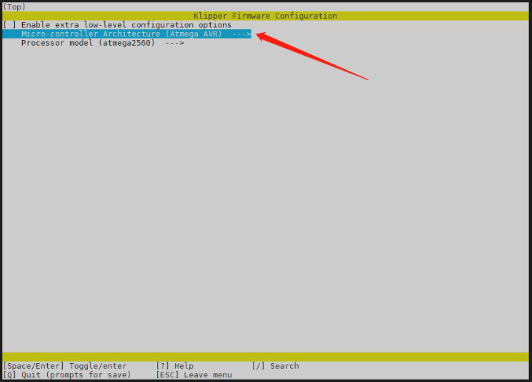
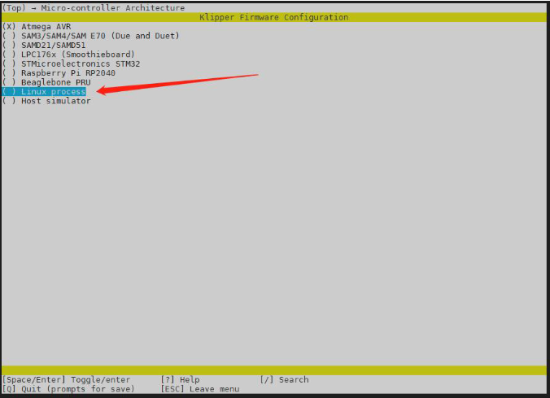
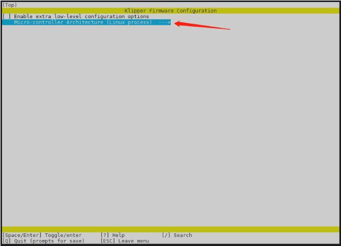
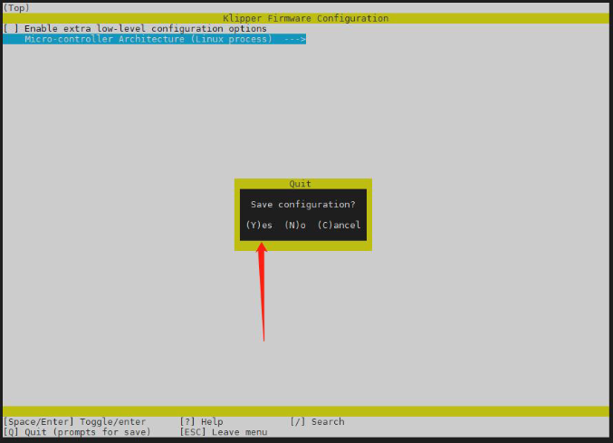
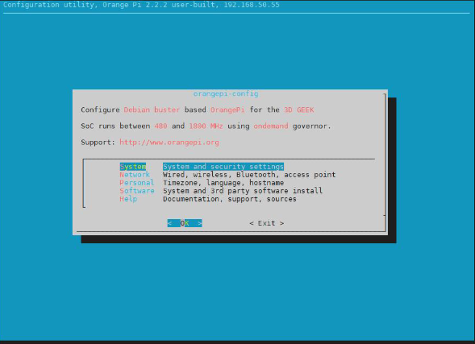
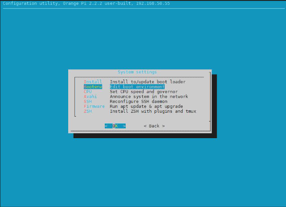
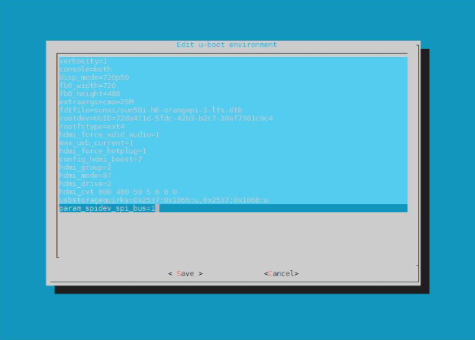
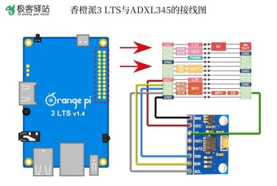
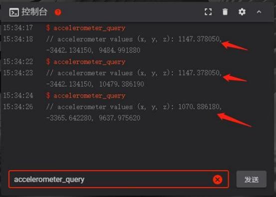
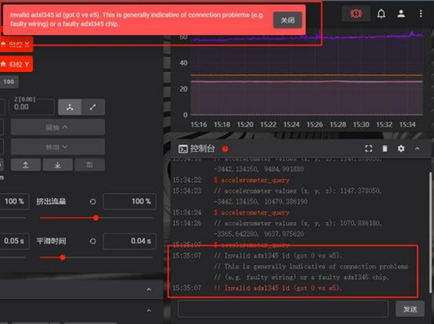

# Using the ADXL345 with the Orange Pi 3 LTS

## Requirements
1. ADXL345 Sensor
2. 6 DuPoint (Male-Male) Wires (Suitable Length to get from your OrangePi to your Extruder)
3. Orange Pi 3 LTS w/ Siboor 3D Geek OS installed. 
4. ADXL345 Mount for your hotend. (Can be printed in PLA as it isn't perminantly attached.)
*Note - this may take a long time, do not do this while your printer is printing as it may result in a failed print.*

1. SSH into your Orange Pi 3. Login with username `klipper` and password `klipper`
2. Install Numpy using PIP
    ```shell
    cd ~
    ~/klippy-env/bin/pip install -v numpy
    ```
3. Install MATP
    ```shell
    sudo apt update
    sudo apt install python3-numpy python3-matplotlib
    ```
4. Set the Orange Pi 3 host as a temporary MCU  
*Note -  this has a lot of steps, ensure you follow them*

    1. Enter the following commands: 
    
        ```shell
        cd ~/klipper/
        sudo cp "./scripts/klipper-mcu-start.sh" /etc/init.d/klipper_mcu
        sudo update-rc.d klipper_mcu defaults
        make menuconfig
        ```
    2. Follow the following options in the menuconfig. Select the Micro-controller Architecture option and press the return button.  
    
        
    3. Set the Micro-controller Architecture to `Linux Process`, you can do this by pressing the space bar when the option you want is highlighted over. 
        
    4. Press the escape button (esc) to move back to the main menu to ensure your `Linux process` option has saved.
        
    5. Press Q to close out and save the MenuConfig menu, you will be prompted if you want to save, press Y to Save what you have done. 
        
    6. Enter the following commands to stop the klipper service, and make your flash
        ```shell
        sudo service klipper stop
        make flash
        sudo service klipper start
        ``` 
5. You now need to enable the SPI Functionality within the Orange Pi 3 LTS, enter the command
    ```shell
    sudo orangepi-config
    ```
    You will be prompted to enter your password, the password is `klipper`. You will  then be presented with a menu, follow the following options. 

    1. Select the `System` menu option, once highlighted over it, press space to select. 

        

    2. Once in the system menu, select the `Bootenv` option 

        
    
    3. Navigate to the bottom of the menu, and add the following at the end `param_spidev_spi_bus=1` once added, press tab, and select `Save`

        

    4. Exit out of the `orangepi-config` menu and reboot the Orange Pi using the command

        ```shell 
        sudo reboot
        ```
    
6. Once the Orange Pi has rebooted, SSH back into the device and run the following command

    ```shell
    ls /dev/spi*
    ```

    if the it returns the following ouput, you have successfully enabled SPI.  
    
    

        

7. add the following to your printer.cfg file via the Fluidd or Mainsail interface*. 
        
    ```yaml
    [resonance_tester]
    accel_chip: adxl345
    probe_points:
        150, 150, 20

    [adxl345]
    cs_pin: rpi:gpiochip1/gpio227
    spi_bus: spidev1.0

    [mcu rpi]
    serial: /tmp/klipper_host_mcu
    ``` 

    Select `Save and Retart Firmware` at the top of the page. 

    *Note - the Fluidd interface is default on all Orange Pi 3 LTS

8. It is now time to install the ADXL345 onto your printer, **Power off the Printer** and unplug it from the mains power.  

    *NOTE: it is essential you get the correct orentation of the Orange Pi and wire each connector into the correct port, reversing this or getting this wrong could perminantly damage your Orange Pi.*

    Wire your printer as per the diagram below. 

    

    Once complete, power on your Orange Pi 3 LTS. 

9. Navigate to your Fluidd/Mainsail interface and enter the following command in to your console
    
    ```gcode
    ACCELEROMETER_QUERY
    ```
    You should see an output similar to what is shown below. 

    
    
    If you get any errors, such as E5, please check your wiring. 

    


